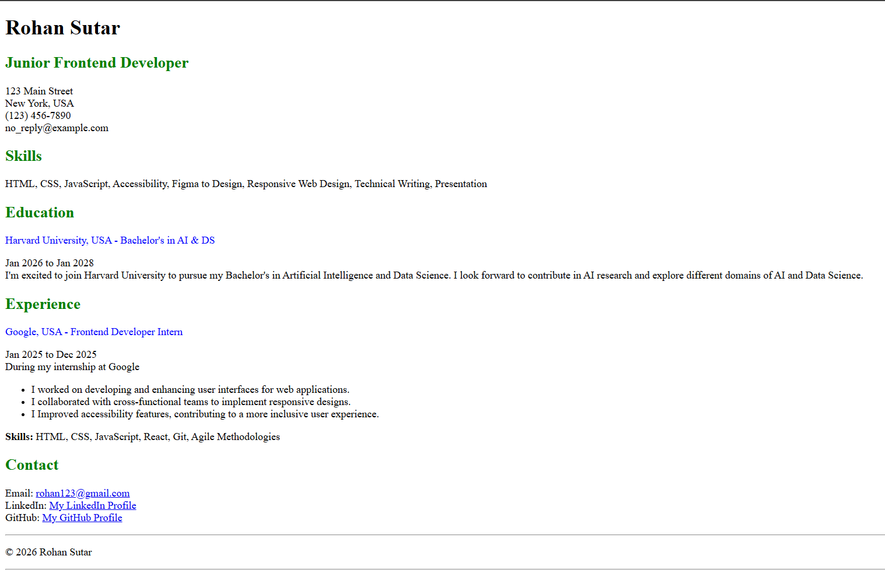

## Single Page CV using HTML
A basic static HTML Page containing general CV/Resume information.

## Preview


## Live Demo
[Project URL](https://roadmap.sh/projects/single-page-cv)

Visit the live project here: [Live link](https://rohanssutar.github.io/Single-Page-CV/)

## File Structure
```text
.
├── index.html      # Main HTML file
├── favicon.png     # Favicon image
└── README.md       # Readme file
```

## Getting started
To run this project locally:
1. Clone the repository:
```bash
git clone https://github.com/Rohanssutar/Single-Page-CV
```
2. Open index.html in your preferred web browser.

